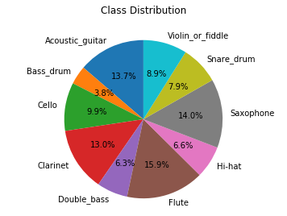

### Musical Istruments Audio Classification

#### Classes:
- Acoustic_guitar   
- Bass_drum        
- Cello           
- Clarinet        
- Double_bass     
- Flute               
- Hi-hat             
- Saxophone          
- Snare_drum         
- Violin_or_fiddle 

#### Notebooks
- Preprocessing.ipynb
- Modelling.ipynb
